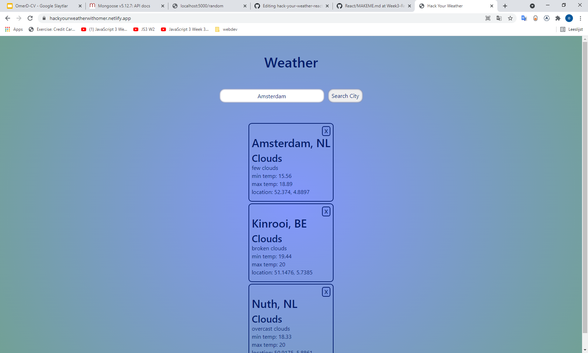
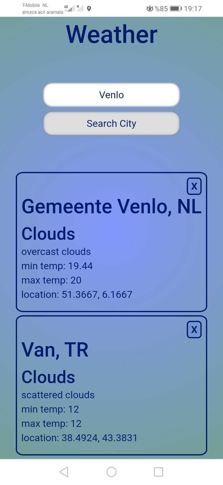

# hack-your-weather-react-app

- Create a weather app using React.
- Working site : https://hackyourweatherwithomer.netlify.app/

## Table of contents

- [Table of contents](#table-of-contents)
- [General info](#general-info)
- [Technologies](#technologies)
- [Features](#features)
- [Screenshots](#screenshots)

## General info

- In this project a weather app is built using React.

## Technologies

- HTML
- CSS
- ReactJS

# Clone this repository

\$ git clone https://github.com/DegirmenciOmer/Chack-your-weather-react-app.git

## Features
-   Display each city in its own box
-   Each box should contain the following pieces of data:
    -   `city name`
    -   `country name`
    -   `weather main`
    -   `weather desciption`
    -   `max and min temprature`
    -   `location (longitude and lattitude)`
- Any time a user searches for a new city, add it to a list of already searched cities
- Only allow a user to use the "Search City" button when the input field has at least 1 character.
- Allow a user to delete a search entry, by clicking the "X" button

## Screenshots

## On mobile :

  

